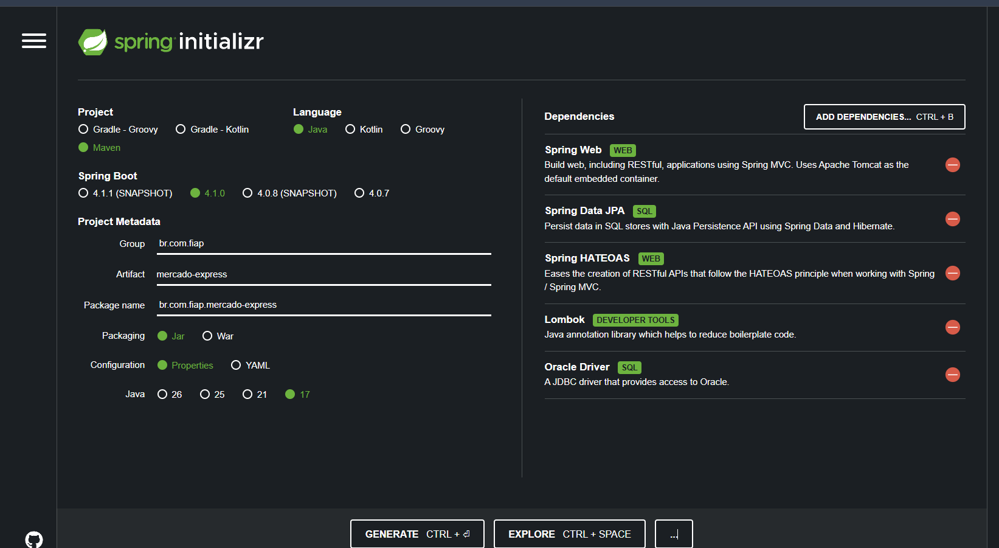

# 🛒 Mercado Express API - Checkpoint 4 (Parte 1)

API RESTful desenvolvida em **Java com Spring Boot** para gerenciamento de produtos em um **Mercado Express** (frutas, limpeza, meias, brinquedos, etc.).

Este projeto atende aos requisitos do **Checkpoint 4 (Parte 1)** da disciplina de **Desenvolvimento de Sistemas em Java (FIAP - TDS)**.

---

## 📌 Tecnologias Utilizadas

- **Java 17**
- **Spring Boot 3.3.x**
- **Spring Data JPA & Hibernate** (Mapeamento da tabela `TDS_TB_MERCADO`)
- **Spring HATEOAS** (Nível 3 de Maturidade REST com navegação Hipermídia)
- **Lombok** (Encapsulamento, Builders e Construtores)
- **Oracle DB / H2 Database** (Suporte ao banco de dados Oracle FIAP e H2 em memória para testes)
- **Tomcat** (Rodando na porta `8082`)
- **Postman / Insomnia** (Validação de Endpoints)

---

## ⚙️ Configuração e Execução Local

### 1. Pré-requisitos
- JDK 17+ instalado
- Maven instalado ou utilitário Maven Wrapper

### 2. Rodar a Aplicação
Abra o terminal na pasta do projeto e execute:
```bash
./mvnw spring-boot:run
```
ou se possuir o Maven instalado:
```bash
mvn spring-boot:run
```

A aplicação iniciará na porta **`8082`**:
`http://localhost:8082/mercado`

### 3. Console do H2 (Para inspeção de banco em dev)
- URL: `http://localhost:8082/h2-console`
- JDBC URL: `jdbc:h2:mem:mercadodb`
- Usuário: `sa`
- Senha: *(em branco)*

---

## 🗄️ Modelo da Entidade (`TDS_TB_MERCADO`)

| Campo | Tipo | Descrição |
| :--- | :--- | :--- |
| `id` | `Long` | Chave Primária (Gerado via Sequence `SQ_TDS_MERCADO`) |
| `nome` | `String` | Nome do produto (Ex: "Sabão em Pó Omo", "Maçã Fuji") |
| `tipo` | `String` | Categoria/Tipo (Ex: "Produto de Limpeza", "Fruta", "Brinquedo") |
| `setor` | `String` | Setor do mercado (Ex: "Limpeza", "Hortifruti", "Brinquedos") |
| `tamanho` | `String` | Tamanho/Embalagem (Ex: "1kg", "500g", "Único") |
| `preco` | `Double` | Preço unitário do produto |

---

## 🔗 Endpoints da API & Documentação CRUD + HATEOAS

A API implementa o **Nível 3 de Maturidade de Richardson (HATEOAS)**, fornecendo links hipermídia `_links` em cada resposta.

### 1. Listar Todos os Produtos (`GET /mercado`)
- **Método**: `GET`
- **URL**: `http://localhost:8082/mercado`
- **Exemplo de Resposta HTTP 200 OK**:
```json
{
  "_embedded": {
    "mercadoList": [
      {
        "id": 1,
        "nome": "Sabão em Pó Omo",
        "tipo": "Produto de Limpeza",
        "setor": "Limpeza",
        "tamanho": "1kg",
        "preco": 19.90,
        "_links": {
          "self": { "href": "http://localhost:8082/mercado/1" },
          "todos-produtos": { "href": "http://localhost:8082/mercado" },
          "atualizar": { "href": "http://localhost:8082/mercado/1" },
          "deletar": { "href": "http://localhost:8082/mercado/1" }
        }
      }
    ]
  },
  "_links": {
    "self": { "href": "http://localhost:8082/mercado" }
  }
}
```

---

### 2. Buscar Produto por ID (`GET /mercado/{id}`)
- **Método**: `GET`
- **URL**: `http://localhost:8082/mercado/1`
- **Exemplo de Resposta HTTP 200 OK**:
```json
{
  "id": 1,
  "nome": "Sabão em Pó Omo",
  "tipo": "Produto de Limpeza",
  "setor": "Limpeza",
  "tamanho": "1kg",
  "preco": 19.90,
  "_links": {
    "self": { "href": "http://localhost:8082/mercado/1" },
    "todos-produtos": { "href": "http://localhost:8082/mercado" },
    "atualizar": { "href": "http://localhost:8082/mercado/1" },
    "deletar": { "href": "http://localhost:8082/mercado/1" }
  }
}
```

---

### 3. Cadastrar Novo Produto (`POST /mercado`)
- **Método**: `POST`
- **URL**: `http://localhost:8082/mercado`
- **Corpo da Requisição JSON**:
```json
{
  "nome": "Kit Meia Soquete",
  "tipo": "Vestuário",
  "setor": "Meias e Acessórios",
  "tamanho": "38-42",
  "preco": 25.90
}
```
- **Resposta HTTP 201 Created** com o objeto criado e os links HATEOAS.

---

### 4. Atualizar Produto Completo (`PUT /mercado/{id}`)
- **Método**: `PUT`
- **URL**: `http://localhost:8082/mercado/1`
- **Corpo da Requisição JSON**:
```json
{
  "nome": "Sabão em Pó Omo Lavagem Perfeita",
  "tipo": "Produto de Limpeza Premium",
  "setor": "Limpeza",
  "tamanho": "1.6kg",
  "preco": 24.90
}
```
- **Resposta HTTP 200 OK** com os dados atualizados.

---

### 5. Atualizar Parcialmente (`PATCH /mercado/{id}`)
- **Método**: `PATCH`
- **URL**: `http://localhost:8082/mercado/1`
- **Corpo da Requisição JSON** (apenas o campo a modificar, ex: preço):
```json
{
  "preco": 22.50
}
```
- **Resposta HTTP 200 OK** com o preço alterado e demais campos preservados.

---

### 6. Deletar Produto (`DELETE /mercado/{id}`)
- **Método**: `DELETE`
- **URL**: `http://localhost:8082/mercado/1`
- **Resposta HTTP 204 No Content** (Sem corpo).

---

## 🖼️ Configuração do Spring Initializr

Dependências selecionadas no [start.spring.io](https://start.spring.io/):
1. **Spring Web**
2. **Spring Data JPA**
3. **Spring HATEOAS**
4. **Lombok**
5. **Oracle Driver**



---

## 🌐 Deploy da Aplicação

- **Plataforma de Hospedagem**: Render / Railway
- **Link de Conexão Ativo**: `https://mercado-express-fiap.onrender.com/mercado`

---

## 👨‍💻 Integrantes do Grupo

Verifique o arquivo [`integrantes.txt`](./integrantes.txt) na raiz do projeto com o nome e RM de todos os integrantes do grupo.
